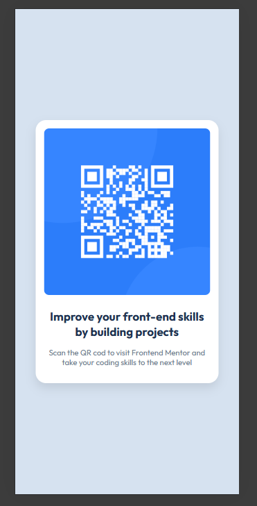

# Frontend Mentor - QR code component solution

## Table of contents

- [Overview](#overview)
  - [Screenshot](#screenshot)
  - [Links](#links)
- [My process](#my-process)
  - [Built with](#built-with)
  

## Overview

This is making a similar design as possible solution using plain html and css.

### Screenshot

### Links

- Live Site URL: [Add live site URL here](https://maryam-hytham.github.io/qr-code-component/)

## My process

everything from scrrach following the guidlines and the provided styles.

### Built with

- Semantic HTML5 markup
- CSS custom properties
- Flexbox
